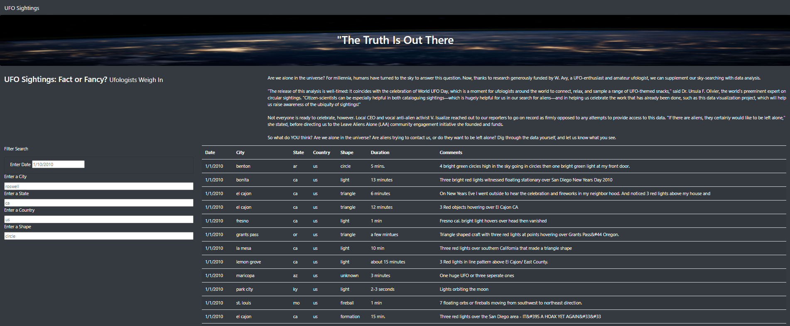
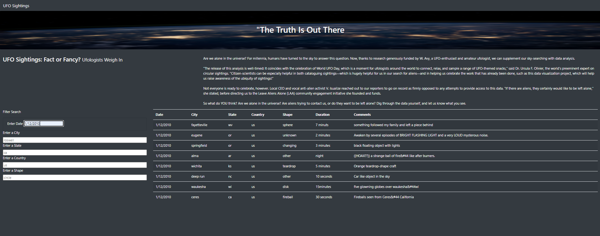
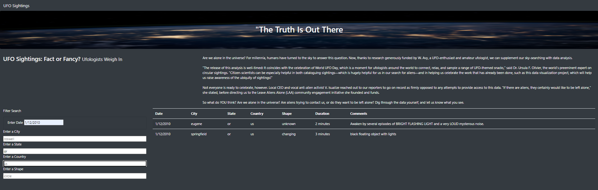

# DABC-UFOs

## Overview:
The purpose of this analysis is to present the set of data relating to UFO sightings on the webpage, allowing the user to filter for a number of criteria (including date, city, state, country, and shape) of the sightings in order to narrow down the search, and the table will dynamically change according to the input.

## Results
As shown in below screenshot, each filter inbox has a placeholder text in place to serve as an example for the user. As no text has been inputted in the below inboxes, no filter has been applied yet.

</img>

As the user types in the filter criteria in the format consistent with the placeholder examples, the 
table will dynamically change and only present rows of data matching the filtered criteria.

To filter for results where the date is Jan 12, 2010, enter "1/12/2010" in the textbox for "Enter Date", and the table will only present rows of data matching the aforementioned date.

</img>

To further filter for results where the sighting of UFO was in the State of Oregon, enter "or" in the textbx for "Enter a State", and the table will further filter the results as shown below.

</img>

### Summary

As illustrated in above examples, the webpage has been built with a user-friendly filter and dynamic table that makes it easy for users to search for specific results without the need to manually scroll through many rows of data.

However, one major drawback of this design is that the filter criteria is based on text inputted by user. Without scrolling through the entire un-filtered table, it is difficult for the user to determine the list of available options to filter for. For example, the user would need to scroll through the whole set of data to know that the table only contains sightings in the month of Jan 2010 and all of the sightings were in the US, eventhough there is a filter for "Country".

To address this drawback, it is recommended that all search-boxes be changed from text-input to dropdown-input, where the user can select an option available from the dropdown list. The dropdownlist for each search criteria can be programmed to be a unique list of each field. For example, the "Date" filter can be a calender for Jan 2010, where only dates on this dataset (Jan 01 to Jan 13) are available for selection. In addition to clarifying the number of options available, this apporach would also prevent the user from making spelling mistakes and retrieving zero search results.

Furthermore, we could also create a general search bar in which the user can type in any search criteria, and the table would dynamically respond by filtering for rows that contain the searched criteria, no matter which field of the table contained this criteria. This can be done on Javascript by attaching an event-listener to listen for "keyups", create a function to loop through each field in the table to look for rows containing the searched criteria, and push the filtered results to a final table to be presented. For example, as the user type in "lights" in the search box, the table would dynamically respond and return 30 rows, as there are 30 rows of data where the Comments contain the word "lights".

Lastly, the table currently shows all data with Duration in its raw format, which is inconsistent from row to row. Therefore, there is no option to filter for "Duration". To make it more user-friendly, we can clean the dataset by looping through all the elements in the raw data, and standardize the Duration property into a format that is consistent and easy to navigate, thereby allowing the user to filter for Duration, amongst other criteria.